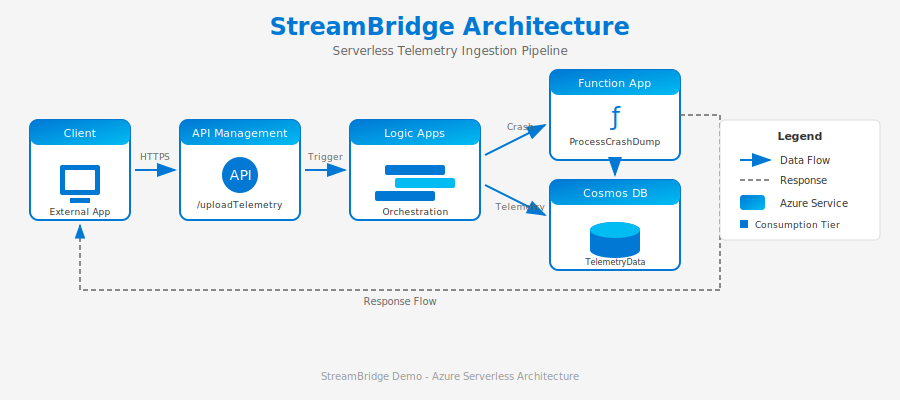

# 🌉 StreamBridge

[](https://azure.microsoft.com)
[](https://docs.microsoft.com/azure/azure-resource-manager/bicep/)
[](https://python.org)
[](LICENSE)

> 🚀 A modern serverless Azure application demonstrating a telemetry ingestion pipeline using Logic Apps, Function App, API Management, and Cosmos DB.

---

## 📊 Architecture



```
┌──────────┐     ┌──────────────────┐     ┌─────────────┐     ┌──────────────┐
│  Client  │────▶│ API Management   │────▶│  Logic Apps │────▶│ Function App │
└──────────┘     └──────────────────┘     └──────┬──────┘     └──────┬───────┘
                                                 │                   │
                                                 ▼                   ▼
                                          ┌─────────────────────────────┐
                                          │        Cosmos DB            │
                                          │  ┌─────────┐  ┌──────────┐  │
                                          │  │ SQL API │  │ Gremlin  │  │
                                          │  └─────────┘  └──────────┘  │
                                          └─────────────────────────────┘
```

### 🧩 Components

| Component | Purpose | Tier | Status |
|-----------|---------|------|--------|
| 🔐 **API Management** | Secure entry point, rate limiting, subscription key validation | Developer |  |
| ⚡ **Logic Apps** | Workflow orchestration, payload validation, routing | Consumption |  |
| 🐍 **Function App** | Crash dump processing | Consumption (Python) |  |
| 📄 **Cosmos DB (SQL)** | Telemetry data storage | Serverless |  |
| 🔗 **Cosmos DB (Gremlin)** | Graph analytics for event relationships | 400 RU/s |  |

---

## ⚡ Quick Start

### 📋 Prerequisites

| Tool | Version | Installation |
|------|---------|--------------|
|  | 2.50+ | `winget install Microsoft.AzureCLI` |
|  | 7+ | `winget install Microsoft.PowerShell` |
|  | 3.9+ | `winget install Python.Python.3.11` |

### 🚀 Deploy in 5 Minutes

```powershell
# 1️⃣ Clone and navigate
cd streambridge

# 2️⃣ Login to Azure
az login

# 3️⃣ Deploy all resources
.\scripts\deploy.ps1 -ResourceGroupName "rg-streambridge" -Location "eastus2"
```

**Or using Bash:**
```bash
chmod +x scripts/deploy.sh
./scripts/deploy.sh -g rg-streambridge -l eastus2
```

---

## 📁 Project Structure

```
streambridge/
├── 🏗️ infrastructure/          # Bicep deployment templates
│   ├── main.bicep              # Main template (all resources)
│   ├── main-consumption.bicep  # Consumption tier variant
│   ├── modules/                # Reusable Bicep modules
│   │   └── graph-database.bicep
│   └── parameters.json         # Default parameters
│
├── 🐍 function-app/            # Python Azure Function
│   ├── function_app.py         # ProcessCrashDump function
│   ├── requirements.txt
│   └── host.json
│
├── ⚡ logic-app/                # Logic App workflow
│   ├── TelemetryIngestion/
│   │   └── workflow.json       # Workflow definition
│   ├── connections.json
│   └── host.json
│
├── 🔐 apim/                    # API Management config
│   ├── api-policy.xml          # APIM policies
│   └── api-openapi.yaml        # OpenAPI specification
│
├── 📜 scripts/                  # Deployment & utility scripts
│   ├── deploy.ps1              # PowerShell deployment
│   ├── deploy.sh               # Bash deployment
│   ├── setup-cosmosdb.ps1      # Cosmos DB setup
│   ├── setup-cosmosdb.sh
│   └── test-api.ps1            # API test suite
│
└── 📚 docs/                     # Documentation
    ├── architecture-diagram.svg
    ├── DEMO-GUIDE.md
    └── sample-gremlin-queries.md
```

---

## 📡 API Reference

### `POST /telemetry/uploadTelemetry`

Upload telemetry data and crash dump metadata.

#### 📨 Headers

| Header | Required | Description |
|--------|----------|-------------|
| `Content-Type` | ✅ | `application/json` |
| `Ocp-Apim-Subscription-Key` | ✅ | Your APIM subscription key |

#### 📦 Request Body

<details>
<summary>📊 Telemetry Only (click to expand)</summary>

```json
{
  "deviceId": "device-001",
  "region": "eastus",
  "timestamp": "2024-01-15T10:30:00Z",
  "telemetryType": "metrics",
  "data": {
    "cpu": 45.2,
    "memory": 72.1,
    "diskUsage": 55.0
  },
  "crashDump": null
}
```
</details>

<details>
<summary>💥 With Crash Dump (click to expand)</summary>

```json
{
  "deviceId": "device-002",
  "region": "westus2",
  "timestamp": "2024-01-15T10:35:00Z",
  "telemetryType": "crashDump",
  "data": {
    "lastKnownState": "running"
  },
  "crashDump": {
    "dumpId": "dump-abc123",
    "errorCode": "0xC0000005",
    "stackTrace": "ntdll.dll!RtlUserThreadStart",
    "processName": "myapp.exe",
    "memoryDumpUrl": "https://storage.blob.core.windows.net/dumps/dump.dmp"
  }
}
```
</details>

#### ✅ Response (200 OK)

```json
{
  "success": true,
  "documentId": "550e8400-e29b-41d4-a716-446655440000",
  "message": "Telemetry data ingested successfully",
  "processingResult": {
    "status": "processed",
    "message": "Crash dump processed successfully"
  },
  "timestamp": "2024-01-15T10:30:05Z"
}
```

---

## 🚦 Rate Limiting

| Metric | Value |
|--------|-------|
| 📈 Requests per minute | **100** per subscription key |
| ⏱️ Rate limit window | 60 seconds |

**Response Headers:**
| Header | Description |
|--------|-------------|
| `X-RateLimit-Remaining` | Remaining calls in window |
| `Retry-After` | Seconds to wait (when rate limited) |

---

## 🔒 Security

| Feature | Implementation | Status |
|---------|---------------|--------|
| 🔑 Authentication | APIM subscription key |  |
| 🎫 Authorization | Managed Identity (Logic Apps → Cosmos DB) |  |
| 🔐 Transport | HTTPS only (TLS 1.2+) |  |
| ✅ Content Validation | JSON schema validation, 100KB limit |  |

---

## 🔗 Graph Analytics

StreamBridge includes a Cosmos DB Gremlin (graph) database for analyzing relationships between telemetry events, devices, and crash patterns.

### 📊 Graph Data Model

```
┌─────────────┐    SENT_FROM     ┌─────────────┐
│   🖥️ Device │◄─────────────────│ 📊 Telemetry│
│   (vertex)  │                  │   (vertex)  │
└─────────────┘                  └─────────────┘
      │                                │
      │ LOCATED_IN                     │ HAS_CRASH
      ▼                                ▼
┌─────────────┐                  ┌─────────────┐
│  🌍 Region  │                  │ 💥 CrashDump│
│   (vertex)  │                  │   (vertex)  │
└─────────────┘                  └─────────────┘
```

### 🏷️ Vertex Types

| Type | Properties | Description |
|------|------------|-------------|
| `device` 🖥️ | `deviceId`, `firstSeen`, `lastSeen` | Physical or virtual device |
| `telemetry` 📊 | `id`, `timestamp`, `telemetryType` | Individual telemetry event |
| `region` 🌍 | `name`, `timezone` | Geographic region |
| `crashDump` 💥 | `dumpId`, `errorCode`, `processName` | Crash event details |

### 🔗 Edge Types

| Type | From → To | Description |
|------|-----------|-------------|
| `SENT_FROM` | telemetry → device | Links telemetry to source device |
| `LOCATED_IN` | device → region | Device's geographic location |
| `HAS_CRASH` | telemetry → crashDump | Links event to crash details |
| `FOLLOWS` | telemetry → telemetry | Temporal sequence |

### 📝 Sample Gremlin Queries

<details>
<summary>🔢 Count all nodes by type</summary>

```gremlin
g.V().groupCount().by(label)
```
</details>

<details>
<summary>🌍 Find all devices in a region</summary>

```gremlin
g.V().hasLabel('region').has('name', 'eastus')
  .in('LOCATED_IN').hasLabel('device')
  .values('deviceId')
```
</details>

<details>
<summary>🔍 Path traversal - trace crash to device and region</summary>

```gremlin
g.V().hasLabel('crashDump').has('errorCode', '0xC0000005')
  .in('HAS_CRASH').hasLabel('telemetry')
  .out('SENT_FROM').hasLabel('device').as('device')
  .out('LOCATED_IN').hasLabel('region').as('region')
  .select('device', 'region')
  .by('deviceId').by('name')
```
</details>

<details>
<summary>⚠️ Find devices with multiple crashes</summary>

```gremlin
g.V().hasLabel('device')
  .where(__.in('SENT_FROM').out('HAS_CRASH').count().is(gt(1)))
  .project('deviceId', 'crashCount')
  .by('deviceId')
  .by(__.in('SENT_FROM').out('HAS_CRASH').count())
```
</details>

> 📚 See [docs/sample-gremlin-queries.md](docs/sample-gremlin-queries.md) for more examples.

---

## 💻 Local Development

### 🐍 Function App

```bash
cd function-app
python -m venv .venv
source .venv/bin/activate  # Windows: .venv\Scripts\activate
pip install -r requirements.txt
func start
```

### 🧪 Test Locally

```bash
curl -X POST http://localhost:7071/api/ProcessCrashDump \
  -H 'Content-Type: application/json' \
  -d '{"deviceId": "test", "region": "local", "crashDump": {"errorCode": "0x80004005"}}'
```

---

## 💰 Cost Estimate

Using Consumption/Serverless tiers for cost-effectiveness:

| Resource | Tier | Est. Monthly Cost |
|----------|------|-------------------|
| 🔐 API Management | Developer | ~$50/month |
| ⚡ Logic Apps | Consumption | ~$0.000125/action |
| 🐍 Function App | Consumption | Free tier (1M executions) |
| 📄 Cosmos DB (SQL) | Serverless | ~$0.25 per million RUs |
| 🔗 Cosmos DB (Gremlin) | 400 RU/s | ~$23/month |

> 💡 **Demo cost estimate:** < $5/day (minimal usage)

---

## 🗑️ Cleanup

```powershell
az group delete --name rg-streambridge --yes --no-wait
```

---

## 📚 Documentation

| Document | Description |
|----------|-------------|
| 🎯 [DEMO-WALKTHROUGH.md](docs/DEMO-WALKTHROUGH.md) | **Interactive demo script with all scenarios** |
| 📖 [DEMO-GUIDE.md](docs/DEMO-GUIDE.md) | Detailed deployment and setup guide |
| 🔗 [sample-gremlin-queries.md](docs/sample-gremlin-queries.md) | Graph query examples |
| 🏗️ [architecture-diagram.svg](docs/architecture-diagram.svg) | Visual architecture |

---

## 📄 License

MIT License - see [LICENSE](LICENSE) for details.

---

<p align="center">
  <sub>Built with ❤️ using Azure Serverless</sub>
</p>
